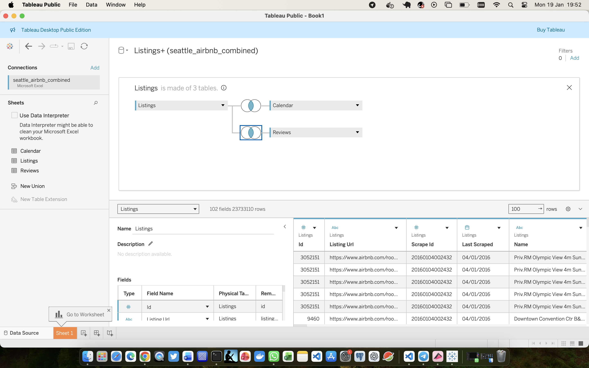
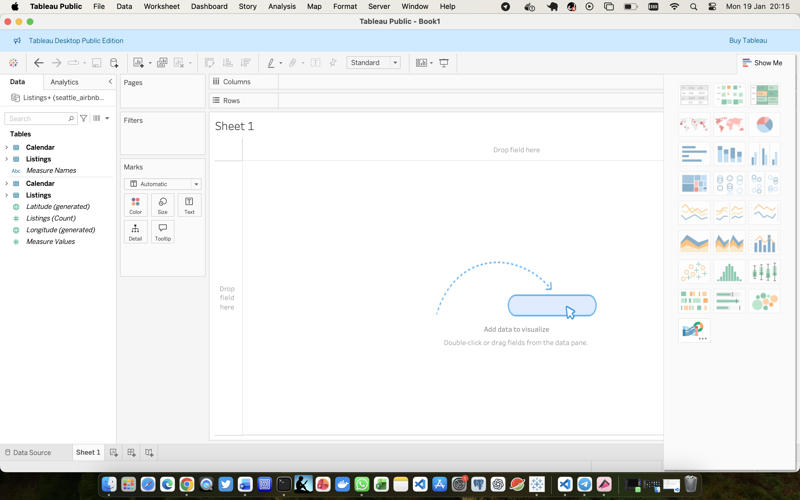
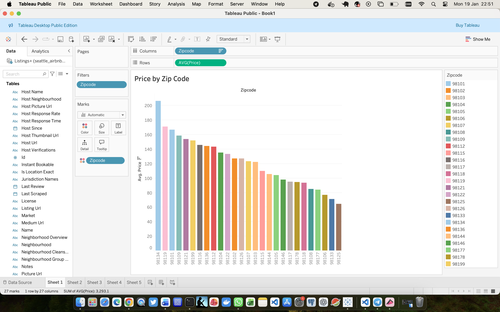
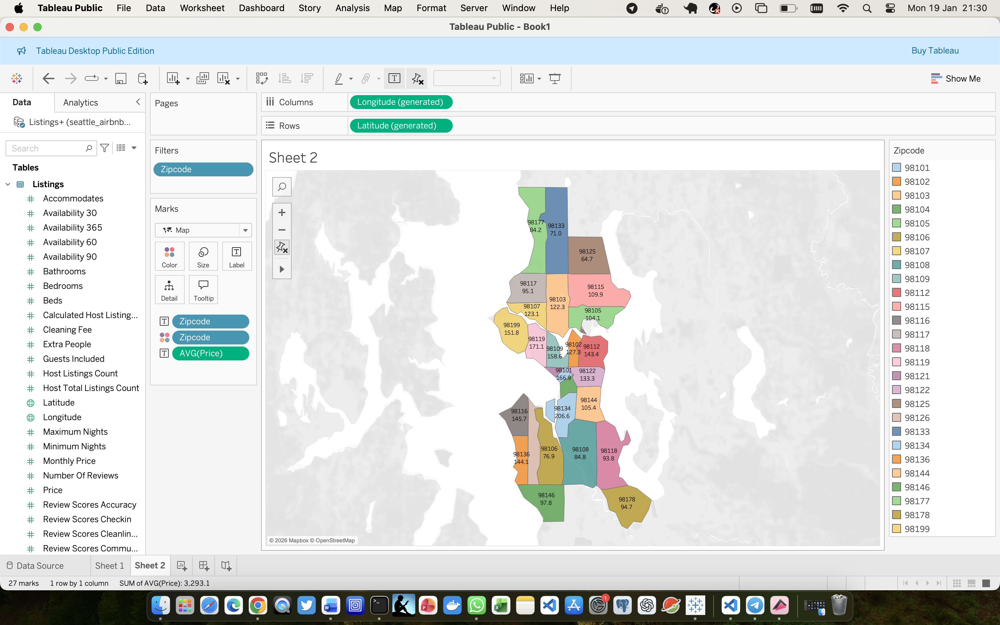
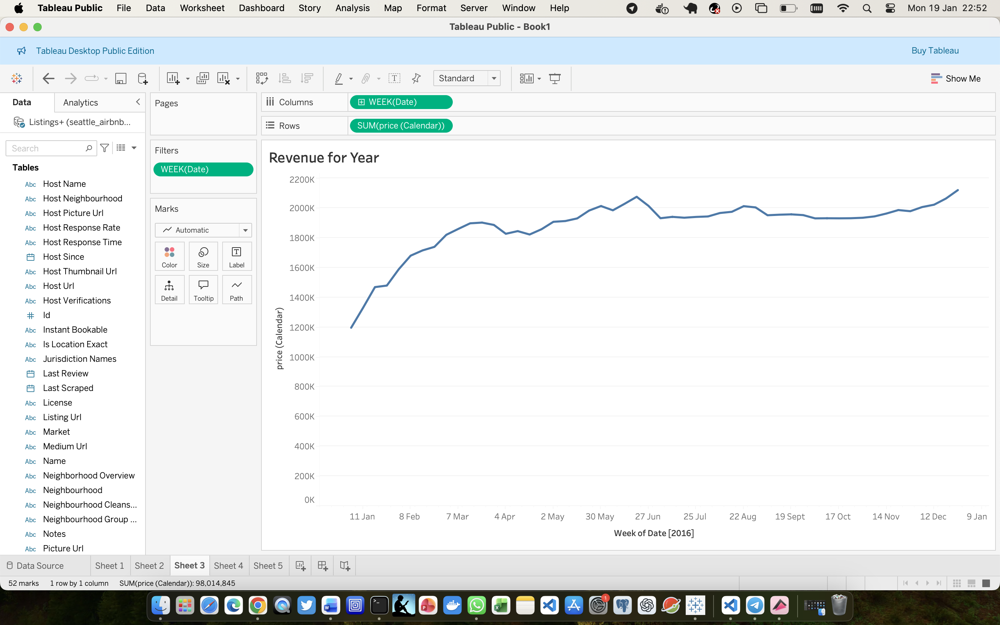
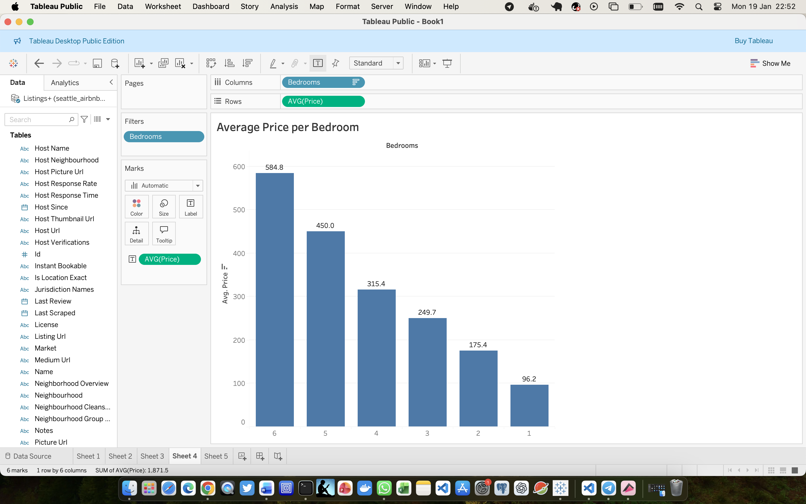
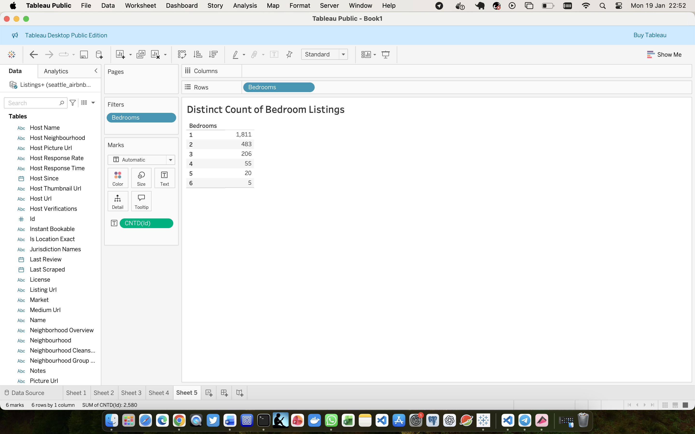
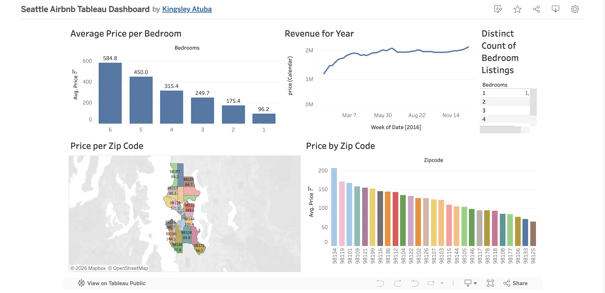

# Seattle Airbnb Tableau Dashboard

## Project Overview

This project analyses Airbnb listing data for Seattle using Tableau Public. The aim is to explore pricing patterns, revenue trends, and listing distribution across different zip codes and property sizes, and to present these insights in a clean, interactive dashboard.

The project demonstrates core data analytics and data visualisation skills, including data modelling, aggregation, time-based analysis, and dashboard design using Tableau.

---

## Business Objective

The objective of this project is to provide an interactive dashboard that helps stakeholders:

- Understand how average Airbnb prices vary by zip code
- Analyse how pricing changes with the number of bedrooms
- Examine revenue trends over time
- Assess the distribution of listings across different property sizes

The dashboard supports data-driven decision-making for hosts, analysts, and stakeholders interested in short-term rental market behaviour in Seattle.

---

## Dataset Description

The dataset is a publicly available Airbnb dataset for Seattle, provided in Excel format. It contains detailed information about listings and calendar-based pricing data.

**Data source:** Public Seattle Airbnb dataset  
**Format:** Excel (`.xlsx`)  
**Granularity:**
- Listings table: One row per Airbnb listing  
- Calendar table: One row per listing per date  

---

## Data Preparation and Cleaning

The dataset required minimal traditional data cleaning, as it originates from a structured and curated open-data source. Instead, data cleaning in this project focused on analytical decisions, filtering, and data modelling choices made within Tableau to ensure accuracy, performance, and clarity.

Key data cleaning and preparation steps included:

- Reviewing all available fields and selecting only those relevant to the analysis, such as price, zip code, bedrooms, and date.
- Excluding records with **null zip codes** to ensure geographic analyses only included valid and interpretable locations.
- Using **average price (AVG)** rather than total price (SUM) to avoid misleading aggregations when comparing pricing across locations.
- Removing the **Reviews** table from the data model to prevent unnecessary row expansion and performance issues, as review data was not required for the planned analyses.
- Ensuring correct join logic between the Listings and Calendar tables by matching **Listings.id** to **Calendar.listing_id**.
- Avoiding premature date filtering, allowing time-based filters to be applied only when required for seasonal and revenue trend analysis.
- Filtered calendar data to focus on **2016**, the most complete year, for time-based revenue analysis.
- Removed unnecessary fields from views to reduce clutter and improve readability.

These steps ensured the dataset remained clean, performant, and analytically sound while preserving the integrity of the original data.

---

## Data Model

The data model consists of two core tables:

- **Listings**: Static listing attributes such as price, bedrooms, and zip code.
- **Calendar**: Date-level pricing data used for revenue analysis.
The tables were joined using the listing identifier to support both geographic and time-based analysis.

---

## Visualisation and Dashboard Design

The dashboard was designed to guide users from high-level pricing insights to deeper analysis of revenue trends and listing distribution.

Key visual components include:

- **Average Price per Bedroom (Bar Chart)**  
  Highlights how pricing increases with property size.

- **Revenue for Year (Line Chart)**  
  Shows weekly revenue trends across 2016 and highlights seasonal patterns.

- **Distinct Count of Bedroom Listings (Table)**  
  Provides supply-side context by showing how listings are distributed by bedroom count.

- **Price per Zip Code (Bar Chart)**  
  Enables comparison of average prices across different Seattle zip codes.

- **Price per Zip Code (Map)**  
  Adds geographic context to pricing differences across the city.

Detailed visual-level design decisions, field selections, and insights are documented in:  
`docs/data_visualisation.md`

---

## Dashboard Overview

The Tableau dashboard is fully interactive and designed for exploratory analysis.

**Live dashboard:**  
https://public.tableau.com/views/SeattleAirbnbTableauDashboard/Dashboard1

### Dashboard Preview

---

## Key Insights

- Airbnb prices vary significantly across Seattle zip codes, indicating strong location-based pricing effects.
- Properties with more bedrooms command substantially higher average prices.
- Revenue increases steadily across the year, with visible seasonal fluctuations.
- One-bedroom listings dominate the market, suggesting strong supply of smaller properties.

---

## Tools and Technologies Used

- Tableau Public
- Microsoft Excel

---

## How to Use the Dashboard

- Hover over visuals to explore detailed tooltips.
- Use filters to focus on specific zip codes or bedroom categories.
- Explore relationships between location, time, and pricing.

---

## Future Improvements

- Add multi-year comparisons if additional calendar data becomes available.
- Introduce neighbourhood-level analysis.
- Enhance interactivity with parameters and dynamic insights.

---

## Author

**Kingsley Atuba**  
Data Analyst | Tableau | SQL | Excel
